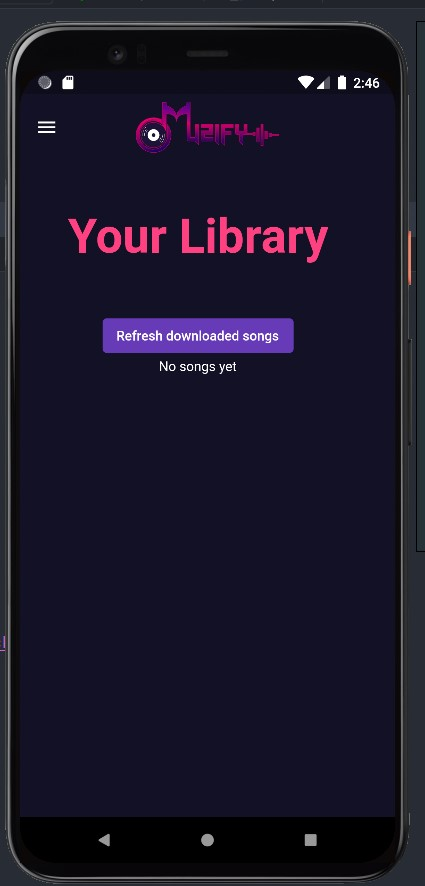

# Muzify

 

 

A `Flutter` based cross-platform music player which is also capable of searching for music, Downloading them locally and playing them offline using it's `python` - `flask` backend running `YTdown` package.

## Getting started

* Main feature of this application is ability to search and download music from youtube to local storage
* The most viewed matching search result is automatically downloaded

 

 

 
 

 

### Log in and Register 

* Muzify uses a `SQLflite` based database to store per-user data locally and enable offline access
* Users can login to a previously created account , create a new account or continue as a guest

 

 

### Home page

* Landing home page where user can play music, the view contains basic intuitive user-friendly widgets to control the playback including pause/play , stop and a seek bar

 

 

### Side action menu

* The side action menu makes it easy to navigate through the app and access rest of the features and uses `provider package` to share data between different views

  
  
  

### Music Library

* Music library menu automatically searches the phone storage for any locally downloaded audio files and lists them in the view to play them

  
  
  
  

